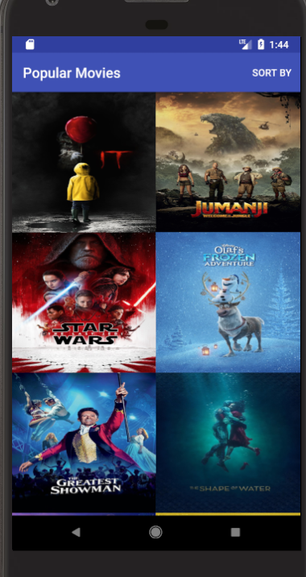

# PopularMoviesStage1
This is the stage 1 of popular movies project as part of Android Developer Nanodegree program.
## Why This Project
As the Popularity of Movies grow, so is the interest in knowing their ratings, popularity, reviews and not the least trailers. This project does all that in a very simplified way.
In this Project, you wil be able to:
* View the movies based on their Polpularity or Ratings.
## Getting Started
My app uses [this](https://www.themoviedb.org/documentation/api) API to retrieve movies. You have to put your own API key in order to build the app. Kindly provide it in MovieUtil.java file.
### Application Preview

